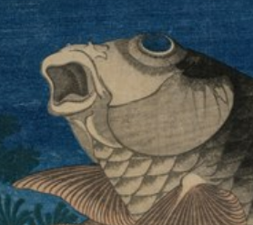

#### Wczytaniei wyświetlanie obrazu
```python
image = cv2.imread(r"koi.png")
cv2.imshow("Image", image)
```
Obraz:<br> 
<br>
Wyświetlenie parametrów i wartości RGB:
```python
(h, w, d) = image.shape
(B, G, R) = image[100, 50]
```
#### Zmiana rozmiaru
```python
resized = cv2.resize(image, (500, 200))
```
Obraz: <br>
<br>
Zmiana rozmiaru z uwzględnieniem proporcji:
```python
r = 400.0 / w
dim = (400, int(h * r))
resized = cv2.resize(image, dim)
```
Można zmienić rozmiar bez liczenia proporcji wykorzystując bibliotkę imutils:
```python
resized = imutils.resize(image, width=400)
```
Obraz:<br>
<br>
#### Obracanie obrazu
Obracanie z obliczeniem środka obrotu:
```python
center = (w // 2, h // 2)
M = cv2.getRotationMatrix2D(center, -45, 1.0)
rotated = cv2.warpAffine(image, M, (w, h))
```
I bez obliczania z imutils:
```python
rotated = imutils.rotate(image, -45)
```
Obraz:<br>
<br>
Obracanie z zachowaniem granic obrazu:
```python
rotated = imutils.rotate_bound(image, 45)
```
Obraz:<br>
<br>
#### Rozmywanie obrazu
```python
blurred = cv2.GaussianBlur(image, (11, 11), 0)
```
Obraz:<br>
<br>
#### Rysowanie na obrazie:
Prostokąt
```python
cv2.rectangle(output, (220, 20), (120, 70), (0, 0, 255), 2)
```
Obraz:<br>
<br>
Koło
```python
cv2.circle(output, (75, 90), 20, (255, 0, 0), -1)
```
Obraz:<br>
<br>
Linia
```python
cv2.line(output, (60, 20), (140, 120), (0, 0, 255), 5)
```
Obraz:<br>
<br>
Tekst
```python
cv2.putText(output, "YOOOOOOOOOOOOOOOOI", (10, 25), 
	cv2.FONT_HERSHEY_SIMPLEX, 0.7, (0, 255, 0), 2)
```
Obraz:<br>
<br>
#### Skala szarości
```python
gray = cv2.cvtColor(image2, cv2.COLOR_BGR2GRAY)
```
Obraz:<br>

<br>
Obraz wykorzystywany w dalszych ćwiczeniach:<br>
<br>

#### Wykrywanie krawędzi:
```python
edged = cv2.Canny(gray, 30, 150)
```
Obraz:<br>
<br>
Threshold:
```python
thresh = cv2.threshold(gray, 225, 255, cv2.THRESH_BINARY_INV)[1]
```
Obraz:<br>
<br>
#### Wykrywanie konturów
Wykrywanie konturów na podstawie funkcji treshold:
```python
cnts = cv2.findContours(thresh.copy(), cv2.RETR_EXTERNAL,
	cv2.CHAIN_APPROX_SIMPLE)
cnts = imutils.grab_contours(cnts)
output = image2.copy()

for c in cnts:
	cv2.drawContours(output, [c], -1, (240, 0, 159), 3)
	cv2.imshow("Contours", output)
	cv2.waitKey(0)
```
Wszystkie wykryte kontury (po 5 krokach):
Obraz:<br>
<br>
#### Wykrywanie obiektów
Ilość obiektów na podstawie ilości wykrytych konturów:
```python
text = "I found {} objects!".format(len(cnts))
cv2.putText(output, text, (10, 25),  cv2.FONT_HERSHEY_SIMPLEX, 0.7,
	(240, 0, 159), 2)
```
Obraz:<br>
<br>
#### Erozja
Erozja krawędzi na podstawie funkcji treshold:
```python
mask = thresh.copy()
mask = cv2.erode(mask, None, iterations=5)
```
Obraz:<br>
<br>
#### Rozszerzanie
Rozszerzanie krawędzi na podstawie funkcji treshold:
```python
mask = thresh.copy()
mask = cv2.dilate(mask, None, iterations=5)
```
Obraz:<br>
<br>
#### Maski
Tworzenie maski na podstawie funkcji treshold:
```python
mask = thresh.copy()
output = cv2.bitwise_and(image2, image2, mask=mask)
```
Obraz:<br>
<br>
